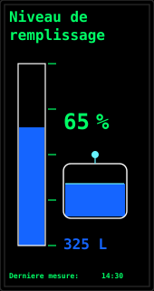
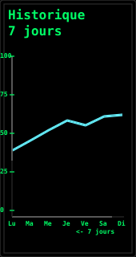
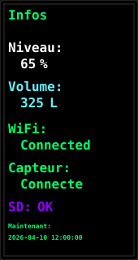
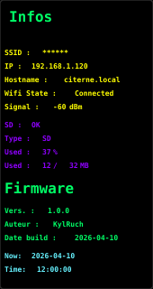
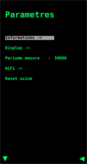
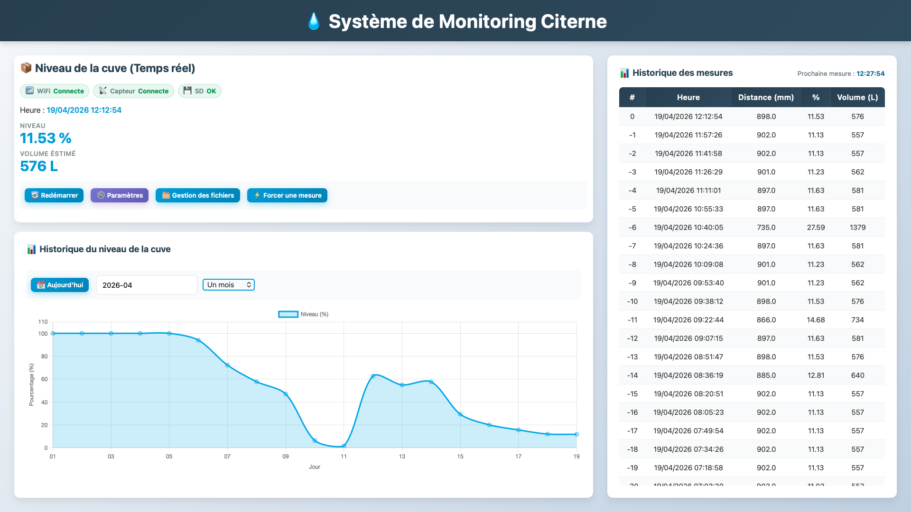
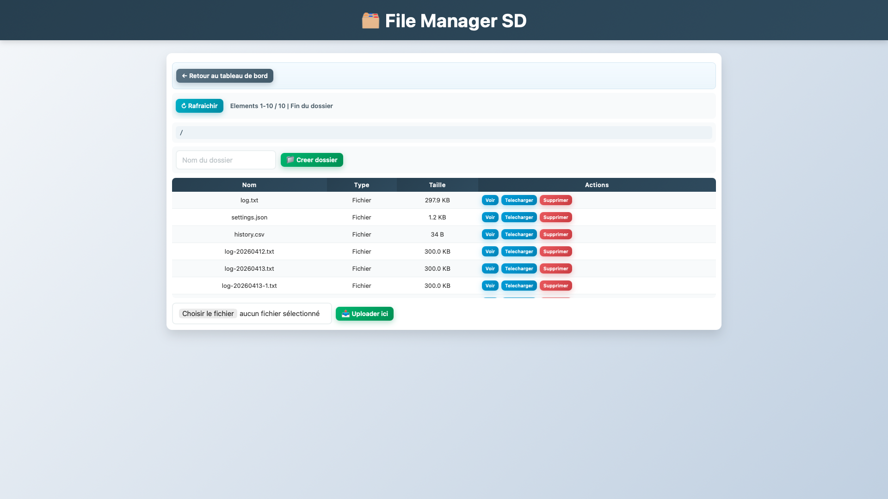
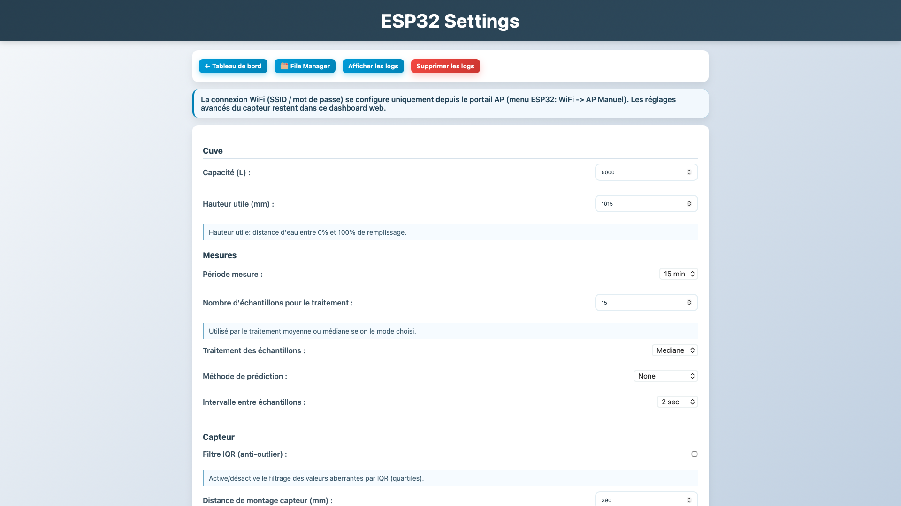
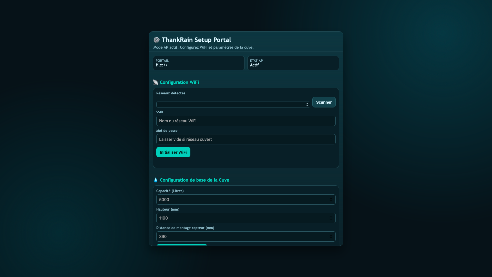

# ThankRainWaterMonitoring

## Overview
This project is a **rainwater tank level monitoring system** based on an **ESP32-S3 LILYGO T-Display S3**.
It measures the water level using a **weather-proof ultrasonic sensor** and logs all measurements to a **microSD card**.
Data can be visualized locally on the integrated display and remotely through a **web interface**.

## Configuration

For the complete setup, check out the **[Setup Guide](SETUP_GUIDE.md)**.

## Hardware Used
- **LILYGO T-Display S3 (ESP32-S3)**
- **Weather-proof Ultrasonic Sensor (SKU: SEN0208)**
- **Adafruit microSD Card Breakout Module**

## Features
- Ultrasonic distance measurement
- Data logging on microSD (CSV format)
- SD resilience layer with automatic health checks, remount retry, and history/log bootstrap
- Structured `log.txt` entries with `INFO` / `WARN` / `ERROR` severity tags and serialized writes
- Graphical interface on the T-Display S3
- Embedded web server to visualize historical data
- Live WiFi / sensor / SD status chips on the web dashboard and on the local screen
- WiFi provisioning portal with async network scan and connection feedback for the first boot
- OTA firmware updates via the local WiFi network with a confirmation flow on error
- File Manager on the webinterface for interfacing with the SD cart form the web interface

## LCD Screen mockups
These mockups are some image of the local screen page:

<table>
	<tr>
		<td align="center"><br><sub>Gauge page</sub></td>
		<td align="center"><br><sub>Weekly graph</sub></td>
		<td align="center"><br><sub>Data summary</sub></td>
	</tr>
	<tr>
		<td align="center"><br><sub>Info page</sub></td>
		<td align="center"><br><sub>Menu page</sub></td>
		<td></td>
	</tr>
</table>

## Web Interface
These previews of the web interface

<table>
	<tr>
		<td align="center"><br><sub>Main dashboard page</sub></td>
		<td align="center"><br><sub>SD filemanager page</sub></td>
		<td align="center"><br><sub>Settings page</sub></td>
	</tr>
</table>

## Web Interface
This preview is the web AP page for Wifi settings
<table>
	<tr>
		<td align="center"><br><sub>AP page for WIFI config</sub></td>
	</tr>
</table>

## Software Stack
- PlatformIO
- ESP32 Arduino Framework
- Async Web Server
- SD / SPI libraries

## Project Structure
```
├── src/            # Main firmware source code
├── include/        # Header files
├── lib/            # Custom libraries
├── data/           # Web interface files (LittleFS)
├── test/           # Unit tests
├── platformio.ini  # PlatformIO configuration
```

Main web UI files in `data/`:
- `portal-index.html` (WiFi provisioning portal)
- `dashboard-index.html`, `dashboard-script.js`, `dashboard-style.css`
- `file-manager-index.html`, `file-manager-script.js`, `file-manager-style.css`
- `settings-index.html`, `settings-script.js`, `settings-style.css`
- `base-style.css` (shared style foundation imported by page-specific styles)

Settings schema module:
- `include/settings_schema.h`
- `src/settings_schema.cpp`

## Web Interface
- Access via the ESP32 IP address or the mDNS name (`citerne.local` by default)
- View live data, history, and system status from the dashboard
- The main dashboard shows live WiFi, sensor, and SD status chips, a graph of the hystoric
- Use `/sd-status` and `/measure-status` for SD and sensor diagnostics
- Use `/logs` to inspect the severity-tagged `log.txt` journal

## Prediction

The firmware includes a `PredictionModule` that provides a short-term forecast of the next measurement computed from recent history. The module keeps up to `PREDICTION_HISTORY_SIZE` entries (see `include/constants.h`) and supports multiple algorithms selectable via the `mesure.predictionMethod` setting:

- `-1`- None: the prediction module is turning off
- `0` — Moyenne (Mean): average of the last N samples (default N = 5).
- `1` — Lagrange: 3-point Lagrange polynomial extrapolation using the last 3 points.
- `2` — Spline cubique: Catmull-Rom cubic spline extrapolation using the last 4 points.
- `3` — Mediane (Median): median of the stored history.

The chosen prediction is computed in `src/sensor.cpp` and used by the dashboard and diagnostics. Use the web Interface or the API for changing this method.

## WiFi Modes and Provisioning

The firmware supports two complementary WiFi behaviors:

- WiFi master switch (`wifi.enabled`): fully enables or disables the radio stack.
- Manual AP action: temporarily starts a local setup AP on demand from the menu (temporary, not persistent).

When the setup AP is active, the ESP runs in `WIFI_AP_STA` mode so:

- local setup access remains available;
- normal STA connection attempts continue in parallel.

The provisioning portal also keeps the connection state visible while a STA
attempt is running, and it surfaces deterministic failures such as bad password
or missing SSID as final errors instead of endless retries.

To enable AP manually:
1. Navigate to "WiFi -> AP Manuel" in the Settings menu
2. Confirm to start AP
3. Credentials screen displays SSID, password, and countdown timer
4. AP auto-disables after 10 minutes of inactivity or when exiting credentials screen

Provisioning AP credentials:

- SSID is generated per device and shown on the TFT when AP starts.
- Password is randomly generated each time the AP mode booting.
- Credentials are shown on TFT.
- AP auto-disables after 10 minutes without connected clients.

### WiFi State Flow (Summary)

```text
WiFi OFF (wifi.enabled=false)
	-> WIFI_DISABLED (radio off, AP off)

WiFi ON (wifi.enabled=true)
	-> Provisioning AP desired?
		 yes (manual AP ON): ensure AP up (WIFI_AP_STA)
		 no: ensure AP down (WIFI_STA)
	-> WIFI_IDLE
	-> WIFI_START_CONNECT
	-> WIFI_CONNECTING
		 -> WL_CONNECTED: WIFI_CONNECTED
		 -> timeout: WIFI_WAIT_RETRY -> WIFI_START_CONNECT
```


## SD Reliability Layer

- SD card access is centralized in [src/storage.cpp](src/storage.cpp)
- Every read/write operation checks SD health with `ensureSDReady()` before access
- On transient SD failures, firmware remounts automatically and retries operations
- `log.txt` is written with a mutex so concurrent diagnostics are preserved
- History and log files are bootstrapped automatically while `settings.json` is preserved
- Storage structure:
```
/									# SD Root
├── history/        				# Main directory of the historic
│	├── 2026/        				# Year directory
│	│	├── 2026-03/            	# Month directory
│	│	│	├── 2026-03-04.csv		# Daily history files
│	│	│	└── ...
│	│	└── monthsummarie/
│	│		├── avg-MM.csv` 		# Monthly summaries files
│	│		└── ...
│	└── ...
├── log.txt  						# Text file of all the log
├── settings.json                 	# Persistent configuration (written during backups)
└── ...
```

## HTTP API Documentation
Full endpoint reference, cURL examples, and test scripts are in [docs/HTTP_API.md](docs/HTTP_API.md).

## License
This project is released under the **[MIT License](LICENSE)**.

## Disclaimer
This project is provided "as is", without any warranty of any kind, express or implied. I make no guarantees regarding its reliability, accuracy, or suitability for any particular purpose. Use it at your own risk. I am not responsible for any damage, data loss, hardware issues, or other problems that may occur as a result of using this project. This is a personal project, shared for educational and experimental purposes, and it may contain bugs, incomplete features, or unexpected behavior.

## Author
Developed by **Limprimeur**
